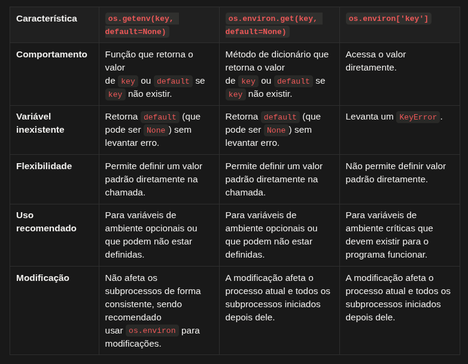

# Qual a diferença entre `os.environ.get()` e `os.getenv()`?

A principal diferença é que `os.getenv()` é uma função que retorna o valor de uma variável de ambiente, aceitando um valor padrão caso ela não exista. Já `os.environ` é um **dicionário mutável** que representa todas as variáveis de ambiente do sistema, e acessar uma variável inexistente via colchetes `os.environ['VAR']` lançará um erro (exceto se usar `os.environ.get()`).

